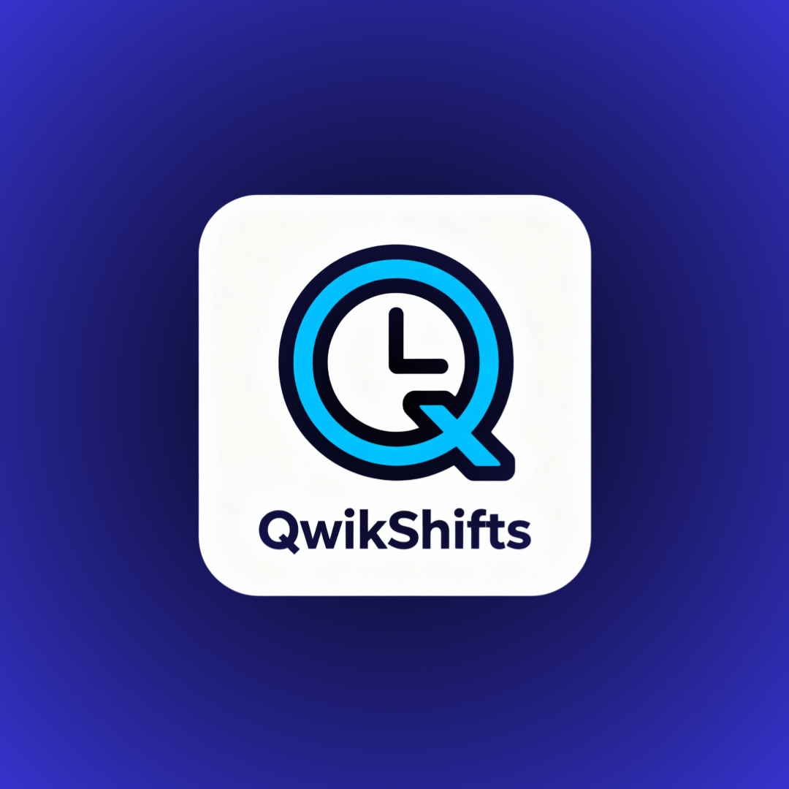

# QwikShifts



**QwikShifts** is a modern, high-performance employee scheduling and management application designed to streamline workforce coordination. Built with a focus on speed and user experience, it offers a comprehensive suite of tools for managers and employees alike.

## 🚀 Features

### 📅 Smart Scheduling
-   **Interactive Schedule Board**: Visual drag-and-drop interface for assigning shifts.
-   **Multi-View Support**: Switch between Day, Week, and Month views to get the right perspective.
-   **Area-Based Organization**: Organize shifts by specific work areas (e.g., Kitchen, Front of House).

### 👥 Employee Management
-   **Comprehensive Profiles**: Manage employee details, roles, and assigned locations.
-   **Role-Based Assignments**: Ensure the right people are in the right jobs with role-specific tagging.
-   **Availability Tracking**: Keep track of when your team can work.

### ⏱️ Time Off & Requests
-   **Streamlined Requests**: Employees can easily request time off directly through the app.
-   **Manager Approval Workflow**: Review and approve/deny requests with a single click.
-   **Conflict Detection**: See time-off conflicts directly on the schedule.

### ⚙️ Powerful Configuration
-   **Customizable Rules**: Set overtime limits and scheduling rules.
-   **Multi-Location Support**: Manage multiple branches or physical locations from one account.
-   **Onboarding Wizard**: A guided flow to get your organization set up in minutes.

### 🎨 Modern Experience
-   **Dark Mode**: Fully supported dark theme for comfortable viewing in low-light environments.
-   **Responsive Design**: Works seamlessly across devices.

---

## 🛠️ Tech Stack

-   **Runtime**: [Bun](https://bun.sh) (Fast JavaScript runtime)
-   **Frontend**: React, Vite, Tailwind CSS, Shadcn UI
-   **Backend**: Hono (Lightweight Web Framework)
-   **Database**: SQLite (via `bun:sqlite`)
-   **Architecture**: Monorepo (Turborepo)

---

## 🏁 Getting Started

### Prerequisites

-   [Bun](https://bun.sh/) (v1.0.0 or later)

### Installation

1.  **Clone the repository**
    ```bash
    git clone https://github.com/yourusername/qwikshifts.git
    cd qwikshifts
    ```

2.  **Setup the project**
    Run the setup command to install dependencies and build the application:
    ```bash
    bun run setup
    ```

### Running the App

#### Development Mode
To run the project with hot-reloading enabled:
```bash
bun run dev
```
-   **API**: http://localhost:3000
-   **Web**: http://localhost:5173

#### Production Mode
To serve the optimized production build:
```bash
bun run start
```

---

## 📂 Project Structure

-   `apps/api`: Backend server handling data persistence and business logic.
-   `apps/web`: Frontend React application.
-   `packages/core`: Shared TypeScript types and utilities used across the monorepo.
